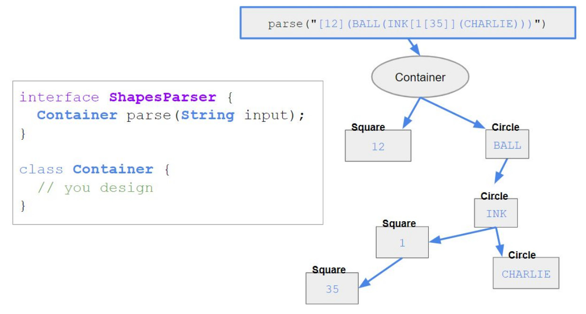

## Design & Implement Shapes Parser

```sh
    Use the programming language of your role:
        ● Android - use Java
        ● IOS - use Swift
        ● Backend - use PHP
```

### Overview
This interview assignment asks you to implement a parser that will parse a contrived syntax
language (​ a made-up syntax ​ ) and return an object representation of the input string (a tree of
objects). The following illustration can help to explain:





The illustration above shows what would happen when you execute the parse function with the
string 

```sh
"​[12](BALL(INK[1[35]](CHARLIE)))​"
```

 - as you can see, it returns a container that
has two shapes: a square and a circle, the circle has its own shapes and so on and so forth.Parser Rules
These are the rules of the parser. Be sure to refer to this when implementing the parser.

```sh
    ● The shapes syntax language consists of shapes: squares and circles.
    ● Each shape has a start symbol, a label, zero or more inner shapes, and the end symbol.
        Examples: ​ ​ [1]​ or ​ (HELLO) ​ or​ (BOY[12]) ​ or​ (APPLE(MAN)[65])
    ● The square bracket symbol denotes the square shape - starts with the symbol​ “[“​ and
        ends with the symbol ​ “]”​ . ​ Example: ​ ​ [123]
    ● The parenthesis symbol denotes the circle shape - starts with the symbol​ “(“​ and ends
        with the symbol​ “)”​ . ​ Example: ​ ​ (CIRCLE)
    ● A shape must have a label.
    ● Squares must be labeled with ​ numbers only​ .
    ● Squares can only contain other squares.
    ● Circles are labeled with ​ uppercase letters only​ .
    ● Circles can contain squares or other circles.
    ● If the input is invalid, an exception is thrown.
```

### Requirements

```sh
    1. Design data structures
        a. Think object oriented design
        b. Think of all the classes you need and their properties and their relationships.
        c. Think of the different kinds of shapes and keep the ​ rules​ in mind.
    2. Design parser
        a. Think of what data structures to use.
        b. Think of the parser logic.
        c. Test your design to make sure it will support all the use cases.
    3. Implement parser
        a. Implement the parser according to your design and the ​ rules​ .
    4. Implement unit tests
        a. Start with example tests.
        b. Think of other tests and implement them.
    5. Submit a zip file containing all of the code (including project
        files)Example Tests
```

The following are some tests to help you test the validity of your parser. You are expected to
implement enough tests to ensure that your parser works. This is not enough tests to validate
your parser, you are expected to start with this and add more.

```sh
    ● Valid inputs include:
        ○ A square: ​ [13]
        ○ A circle: ​ (DOG)
        ○ A circle with inner square ​ (DOG[15])
    ● Invalid inputs include:
        ○ Invalid input: ​ $@#
        ○ Malformed input:​ [13​ )
        ○ Invalid inner shape: ​ [72​ (HELLO)​ ]
        ○ Invalid label (lower case): ​ [ ​ allow​ ]
        
```

### PLEASE NOTE: 

This exercise is for the sole purpose of determining your skills. The
purpose of this exercise is to showcase your design, coding, and testing skills in the
given time span. Please read the complete requirements carefully and do your best.


### SOLUTION

The solution was designed using Java and the jgraphx library for visual tree display.
The Data Structure used is a Generic Tree which is a special type of Graph Data Structure.
Multiple tests exist to verify that the solution satisfies the specifications.
Powered by Maven

#### Compile

```sh
$ mvn clean package
```

#### Test

```sh
$ mvn clean test
```

#### Run

```sh
$ java -jar target/shapeshifter-5.14.0.0.jar
```


